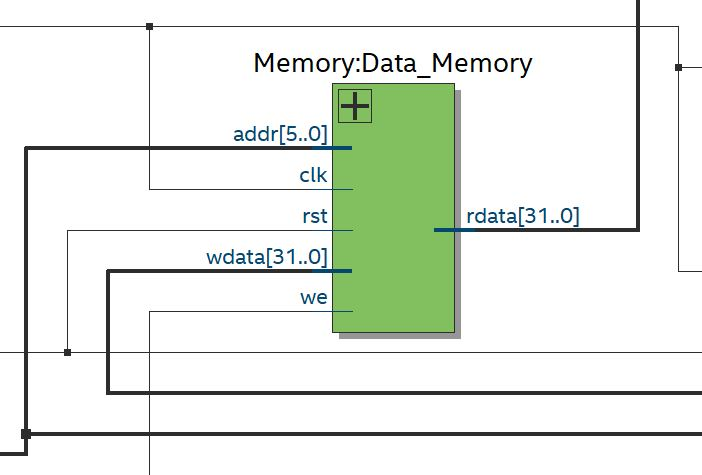
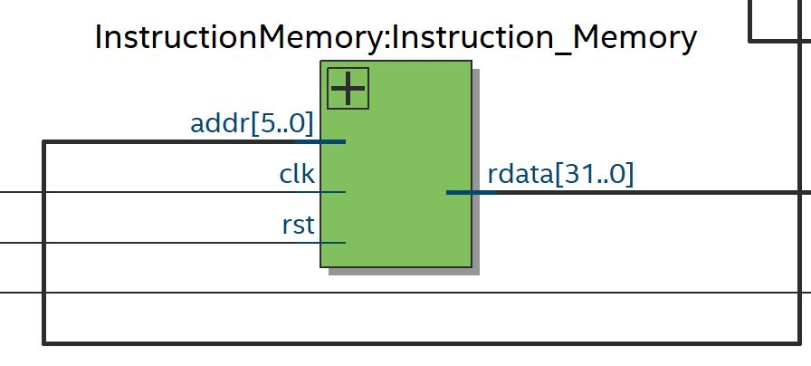
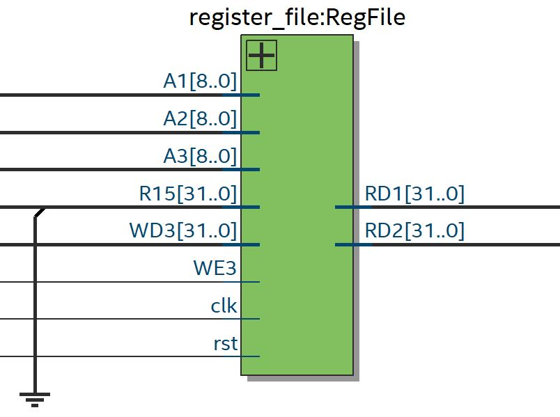
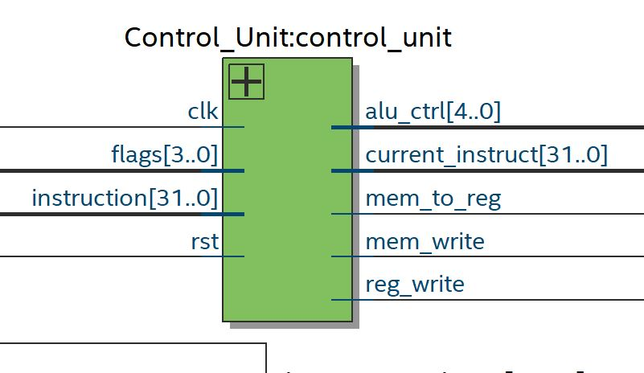
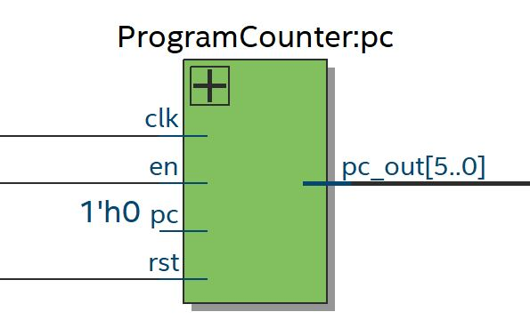
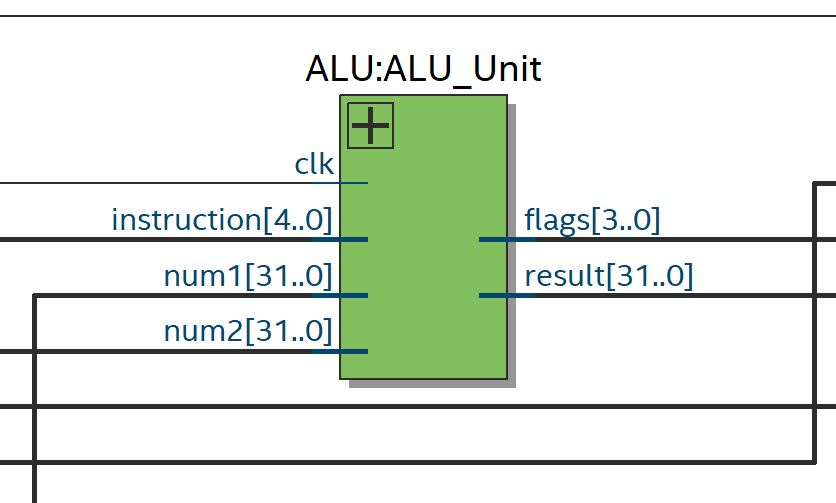

# ARM Microcontroller Implementation
In this project, we built an ARM microcontroller using Verilog HDL to program the logic behind the following modules which were combined together to obtain an useful integration of a microprocessor and instruction/data memories. 

The modules that were put into consideration for this design were the following. 
## Memory Modules 
Instruction and data memories were implemented as an array of 'reg' data types in Verilog which can be used to store data through time. They are parametrized to  adjust their storage capacity in an easy way for different requirements. In our current design, instruction and data memories are separated in different modules, following a Harvard architecture with a word length of 32-bits and 64 different addresses. 

**Data Memory**

**Instruction Memory**

## Register file 
The register file was built as a group of 15 general purpose internal registers (R0-R15) with the additional Program Counter register (R15) and the Status Register. It allows to write and read data from registers according to the current instruction. 

## Control Unit
The control unit encapsulates a 3 stage pipeline which includes:
1) Fetch Stage: The current instruction is received from the instruction memory and is stored internally in the control unit module. 
2) Decode Stage: The previous fetched instruction is separated into 4 different sections. The opcode which is 5 bits long, and three 9-bit numbers which could represent memory addresses or register indexes depending on the instruction nature. 
3) Execute Stage: The decoded instruction is processed and control unit flags get updated to define the data flow according to the current operation to be executed. 

## Program Counter
This module represents a simple counter which increments each clock cycle, further updates will include a multiplexer to decide where will the current instruction index will be taken from so programs with conditionals can be supported. 

## ALU
The Arithmetic Logic Unit was implemented in a modular way, with each ALU instruction with its own module. Currently, arithmetic, logical and shifting operations are supported and each operation yields a 32-bit result along with the negative/zero/overflow/carry flags. 

